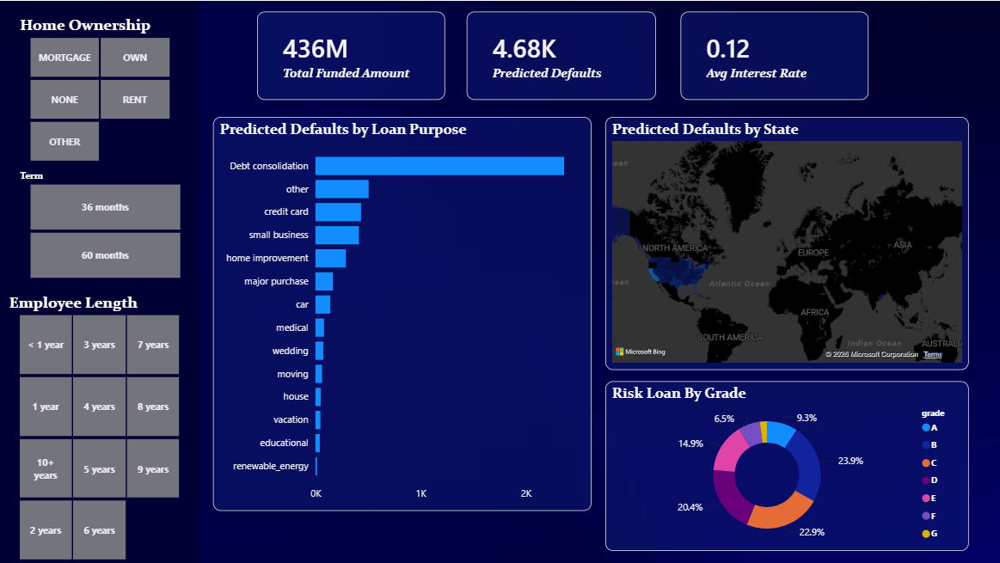

# 🏦 Predictive Bank Loan Analytics & Machine Learning Dashboard

   

## 📌 Executive Summary
This project is an end-to-end Machine Learning and Data Analytics pipeline designed to evaluate a **$436M bank loan portfolio**. Moving beyond traditional historical reporting, this project utilizes Python-based machine learning to predict loan defaults, identify high-risk segments, and visualize portfolio vulnerabilities. 

By engineering a custom predictive model and connecting its outputs to a highly interactive Power BI dashboard, thousands of raw loan records were transformed into forward-looking, actionable intelligence for underwriting teams.

## 🛠️ The Full-Stack Analytics Workflow

### 1. Data Processing & Structuring (SQL)
* **Ingestion & Cleaning:** Extracted raw financial data containing over 38,000 records of borrower demographics, loan attributes, and repayment status.
* **Transformation:** Utilized custom queries (`Bank_loan_data_queries.sql`) to handle missing values, standardize financial formats (DTI, income, term, interest rates), and derive structured features for model training.

### 2. Machine Learning & Predictive Modeling (Python)
* **Algorithm Training:** Developed a custom Python script (`model_training.py`) to analyze historical repayment behaviors (Good Loans vs. Bad Loans).
* **Prediction Generation:** Deployed the model against the loan database to calculate predicted default risks for individual borrower profiles.
* **Data Export:** Outputted the results into a finalized, structured dataset specifically optimized for seamless integration with business intelligence tools.

### 3. Dashboard Engineering & UI/UX (Power BI)
* **Custom Architecture:** Built a completely custom "Dark Mode" aesthetic using transparent glass containers and conditional formatting to intuitively highlight predicted risk areas.
* **Dynamic Filtering:** Engineered interactive slicers (Home Ownership, Loan Term, Employment Length) allowing stakeholders to drill down into specific borrower profiles and watch predicted KPIs recalculate in real-time.
* **Geospatial Analytics:** Integrated a dark-themed map to visualize the ML model's predicted default risk by state, exposing regional vulnerabilities at a glance.

## 🧠 Key Predictive Insights

1. **The Primary Risk Driver:** **Debt Consolidation** is the single largest contributor to predicted default risk, dwarfing all other loan purposes combined. The model recommends stricter Debt-to-Income (DTI) thresholds for this segment.
2. **The "Safe Borrower" Illusion:** Filtering for highly seasoned workers (10+ years of employment) still reveals **1.20K predicted defaults**, proving that employment stability alone does not negate the risk of over-leveraged borrowers.
3. **Mid-Tier Risk Accumulation:** While Grades F and G carry the highest individual risk percentages, the model flags the vast majority of total portfolio vulnerability in **Grades B, C, and D**, where standard underwriting criteria may be too lenient at volume.

## 🤖 Machine Learning Model Performance
* **Algorithm Chosen:** Random Forest Classifier
* **Why Random Forest?:** Selected for its robust handling of non-linear financial variables and ability to manage complex relationships between borrower demographics and loan attributes without overfitting.
* **Accuracy:** 84% 
* **Evaluation Metrics:** Leveraged `scikit-learn` to generate comprehensive classification reports, tracking precision, recall, and f1-scores to evaluate the model's performance across both fully paid and charged-off loan segments.

## 🚀 How to Run the Project Locally
1. Clone this repository to your local machine:
   `git clone https://github.com/soumyapandey13/Predictive-Bank-Loan-Analysis.git`
2. Install the required Python dependencies:
   `pip install -r requirements.txt`
3. Run `model_training.py` in the `scripts` folder to process the data and generate the predictions.
4. Open the `.pbix` file located in the `dashboard` folder using **Microsoft Power BI Desktop** to view the interactive visualizations.

## 📁 Repository Structure
* **`/scripts/`** - Contains `Bank_loan_data_queries.sql` and `model_training.py` used for processing and predictive modeling.
* **`/dashboard/`** - Contains the final interactive Power BI `.pbix` file.
* **`/data/`** - Contains the raw `Bank_loan_data` and the processed `ML_Dataset_For_PowerBI`.
* **`/media/`** - Contains high-resolution screenshots and video demonstrations of the UI.

mail - pandeysoumyaa13@gmail.com
